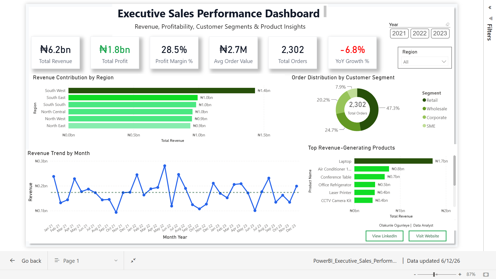

# Executive Sales Performance Dashboard

Power BI | DAX | Power Query | Data Modeling

## Project Objective

To analyze sales performance across regions, customer segments, and products, and provide actionable insights to support business decision-making.

## Project Overview

This Power BI dashboard provides an executive-level view of sales performance, profitability, customer segments, and product performance from 2021–2023.

The objective of the project was to transform raw sales data into actionable business insights that support strategic decision-making.

## Dashboard Preview

## Key Metrics

- Total Revenue: ₦6.2bn
- Total Profit: ₦1.8bn
- Profit Margin: 28.5%
- Average Order Value: ₦2.7M
- Total Orders: 2,302
- YoY Growth: -6.8%

## Dashboard Features

- Revenue contribution by region
- Customer segment analysis
- Monthly revenue trend analysis
- Top revenue-generating products
- Interactive Year and Region filters

## Business Insights

- South West generated the highest revenue contribution.
- Retail customers accounted for the largest share of orders.
- Revenue showed fluctuations across the reporting period.
- A small group of products generated a significant share of total revenue.
- Year-over-Year growth declined, highlighting potential areas for investigation.

## Tools Used

- Power BI
- Power Query
- DAX
- Data Modeling

## Dataset

This project uses a simulated retail sales dataset created for portfolio and learning purposes.

## Files Included

- Dashboard Screenshot (.png)
- Project Documentation
- customers.csv
- orders.csv
- products.csv
- regions.csv
